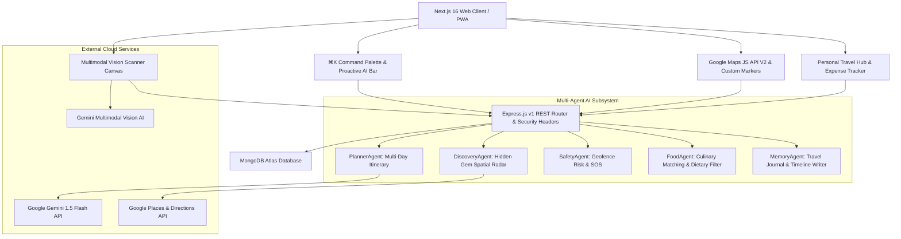

# 🌍 LocalLens AI 3.0 — Architecture & System Design Specification

> **"Your Proactive AI Travel Operating System."**

LocalLens AI 3.0 is a multi-agent AI travel operating system that combines Google Maps spatial intelligence, Gemini AI enrichment, Apple Maps-style information sheets, linear ergonomics, and live telemetry widgets into a single unified platform.

---

## 🏛️ System Architecture Diagram

---

## 🛠️ Technology Stack Breakdown

| Layer | Technology | Description |
|---|---|---|
| **Frontend** | Next.js 16 (App Router + Turbopack), React 19, TypeScript | High-performance server/client rendered UI with glassmorphism CSS engine. |
| **Styling & UI** | Tailwind CSS v4, Lucide React Icons, Framer Motion, GSAP | Animated transitions, responsive design, dark/light theme support. |
| **Backend Server** | Node.js (v22 LTS), Express.js | 22 REST Router modules mounted under `/api/v1`. |
| **Spatial Engine** | Google Maps JS API, Places API, Directions API, Geocoding API | Live Satellite, Terrain, Traffic, Zoom, and Custom Markers. |
| **AI Intelligence** | Gemini 1.5 Flash Multimodal API, Firebase AI Logic | Conversational chat, structured itineraries, vision AI scanners. |
| **Database** | MongoDB Atlas, Mongoose ODM | User accounts, itineraries, saved bookmarks, expense logs, posts. |
| **Security & Rate Limiting** | Helmet, CORS, Express Rate Limiting, JWT | Protection against DDoS and unauthorized endpoint calls. |

---

## 📊 Database Collections Schema

1. **`Users`**: User authentication, profiles, Travel DNA scores, Explorer levels.
2. **`PlannerItineraries`**: Saved multi-day trip itineraries with budget breakdowns and packing checklists.
3. **`SavedPlaces`**: Bookmarked locations, hidden gems, and restaurants.
4. **`Expenses`**: Logged travel costs by category (Hotels, Food, Shopping, Fuel, Activities, Flights).
5. **`Memories`**: Media assets (Photos, Videos, Voice notes) and automated AI travel journal summaries.
6. **`Posts`**: Social feed stories, reels, public itineraries, and traveler reviews.
7. **`Partners`**: Enterprise hotel/restaurant listings, trust scores, and ad campaigns.

---

## ⚡ Core API Endpoints

- `POST /api/v1/ai/chat` — Conversational travel assistant with prompt suggestions.
- `POST /api/v1/ai/plan-trip` — Structured multi-day itinerary generation.
- `POST /api/v1/ai/risk-analyzer` — Real-time travel safety and risk assessment.
- `GET /api/v1/maps/places` — Google Places search with category filtering.
- `GET /api/v1/maps/hidden-gems` — Spatial hidden gem discovery.
- `POST /api/v1/vision/analyze` — Multimodal visual analysis for landmarks, menus, and receipts.
- `GET /api/v1/admin/overview` — Startup operational metrics and telemetry.
