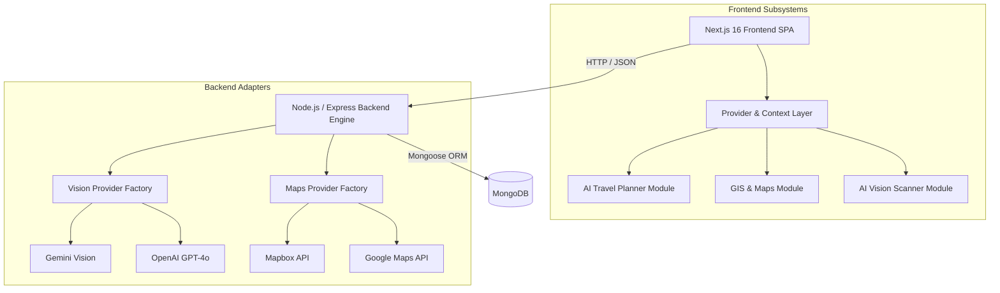

# LocalLens AI — System Architecture Overview

Architect: Prasham Jain (`PrashamJain1318`)

---

## 1. Executive Summary
LocalLens AI is a modular, high-performance web platform for AI-powered travel planning, interactive GIS mapping, and computer vision landmark recognition. The architecture decouples client presentation from backend processing while standardizing provider abstractions across LLMs, Map SDKs, and Vision models.

---

## 2. High-Level Architecture Diagram

---

## 3. Core Design Principles
1. **Provider Abstraction**: Unified interface factories wrapping external AI and GIS APIs.
2. **Context-Driven State**: Decoupled domain state handlers isolating page views from API fetching logic.
3. **Type Safety**: Strictly typed TypeScript data models preventing runtime mutations.
4. **Resilient Error Handling**: Centralized rate limiting, fallback UI, and standardized JSON error formatters.
