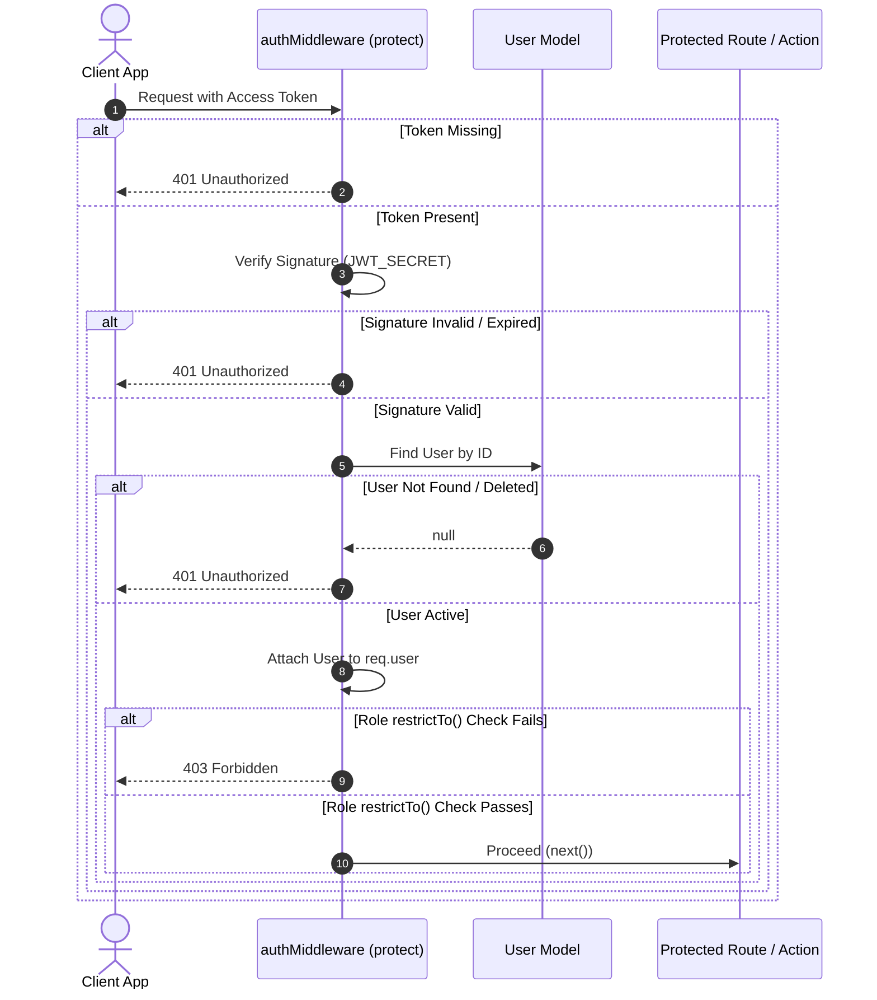

# LocalLens AI Authentication & Authorization Architecture

This document describes the security patterns, token strategies, secure cookie attributes, session lifecycle transitions, and middleware flows implemented in the LocalLens AI platform (Phase 4).

---

## 1. Token Strategy (JWT)

LocalLens AI utilizes a double-token strategy (short-lived Access Tokens + long-lived Refresh Tokens) to ensure high security and seamless user sessions.

```
+-------------------+             +-----------------------+             +-------------------------+
|   Access Token    |             |     Refresh Token     |             |      Cookie Options     |
|  (Short-lived)    |             |     (Long-lived)      |             |     (HTTP-Only, SSL)    |
|       15m         |             |          7d           |             |   SameSite=Lax, Secure  |
+-------------------+             +-----------------------+             +-------------------------+
```

### Access Token
- **Lifetime**: 15 minutes.
- **Delivery**: Sent to client as an HTTP-only secure cookie or read via the `Authorization: Bearer <token>` header.
- **Payload**: Contains minimal user metadata (`id` and `role`).

### Refresh Token
- **Lifetime**: 7 days.
- **Delivery**: Exclusively stored as an HTTP-only secure cookie (`/api/v1/auth/refresh`).
- **Storage**: Verified on the backend to issue new short-lived Access Tokens silently when they expire.

---

## 2. Secure Cookie Policy

To mitigate Cross-Site Scripting (XSS) and Cross-Site Request Forgery (CSRF) vulnerabilities, all token cookies use the following settings:

* **`HttpOnly`**: Enforced to prevent client-side JavaScript access (e.g. `document.cookie`).
* **`Secure`**: Enforced in production (`NODE_ENV === 'production'`) so that cookies are only sent over encrypted SSL/TLS (HTTPS) connections.
* **`SameSite`**: Set to `Lax` or `Strict` to protect against CSRF attacks.

---

## 3. Authentication & RBAC Middleware Flow



---

## 4. Session Lifecycle & Flows

### Password Security Guidelines
- Hashed using **bcrypt** with a salt work factor of **12** rounds on the database level prior to persistency hooks.
- Enforced password length verification rules (minimum of 8 characters).

### Logout Flow
- Requests to the logout route clear the active token cookies on the client side:
  ```javascript
  res.clearCookie('accessToken');
  res.clearCookie('refreshToken');
  ```

### Token Refresh Flow
1. Client makes a request to a protected endpoint.
2. The endpoint returns a `401 Unauthorized` (Token Expired).
3. Client app catches this and makes a request to `/api/v1/auth/refresh`, sending the secure Refresh Token cookie.
4. The server validates the Refresh Token.
5. If valid, the server generates and returns a new Access Token.
