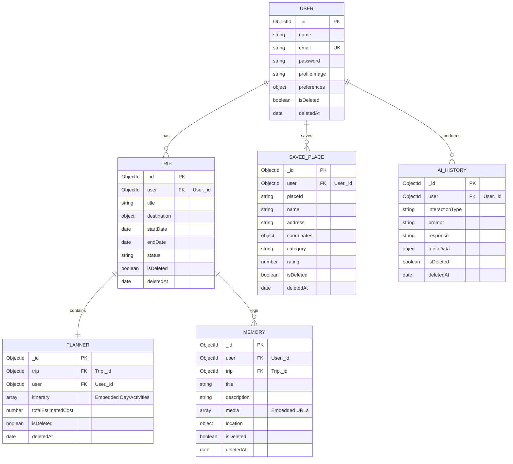

# Database Entity Relationships (ERD) & Architecture

This document defines the LocalLens AI MongoDB data model, indices, relationships, and validation design.

---

## 1. Entity Relationship Diagram (ERD)

---

## 2. Embedding vs Referencing Policy

- **Embedded Arrays**:
  - **`Planner.itinerary`**: Day structures and individual activities are embedded inside `Planner` records. This provides fast page loads for trip itineraries since all daily activities are resolved in a single document query.
  - **`Memory.media`**: Cloudinary URLs and IDs are embedded because they are closely bound to the specific parent Memory document.
- **Reference References**:
  - **`Trip` ➔ `User`**: A standard one-to-many model using `ObjectId` referencing.
  - **`Planner` ➔ `Trip`**: Unique referenced association ensuring one planning dashboard maps precisely to one Trip record.

---

## 3. High-Performance Indexing Design

| Collection | Indexed Key Target | Type | Purpose |
| :--- | :--- | :--- | :--- |
| **`User`** | `email: 1` | Unique | Accelerates credential login & prevents duplicate user creation. |
| **`Trip`** | `user: 1, status: 1` | Compound | Fast loads of active/past user trip filters. |
| **`SavedPlace`** | `user: 1, placeId: 1` | Compound Unique | Prevents users from saving duplicate Google Places records. |
| **`AIHistory`** | `user: 1, createdAt: -1` | Compound | Quick retrieval of history in chronological order. |
